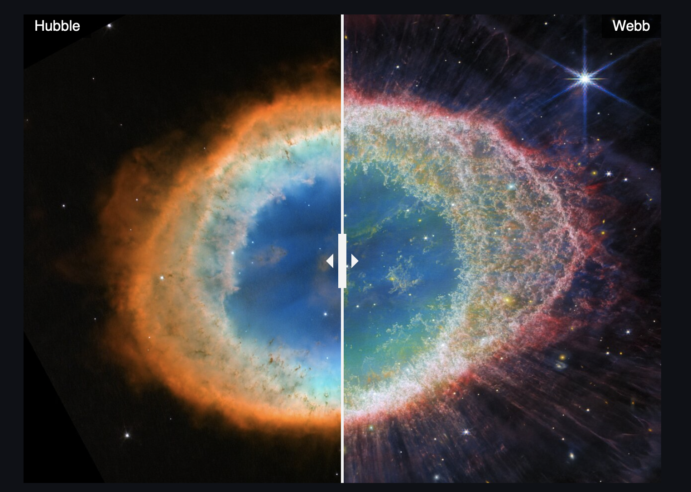
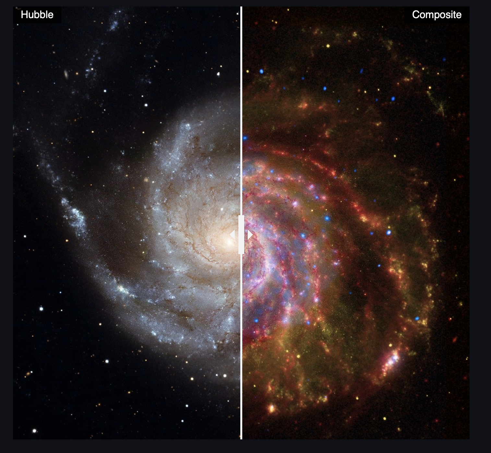

# Telescope-Image-Comparisons

This Streamlit app allows you to explore and compare images from space telescopes such as Hubble, James Webb, Spitzer, and Chandra.

## Features

- Interactive image comparison slider for various celestial objects.
- Compare optical, infrared, and X-ray views of galaxies, nebulae, and star clusters.
- Highlights major objects like the Pillars of Creation, M101, Ring Nebula, Cartwheel Galaxy, and more.

## Site: [telescope-compare.streamlit.app](https://telescope-compare.streamlit.app)

## Screenshots

